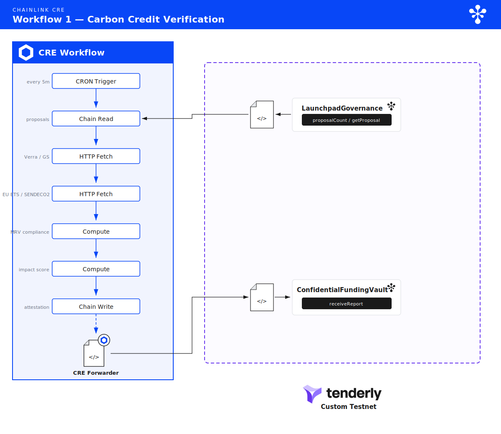
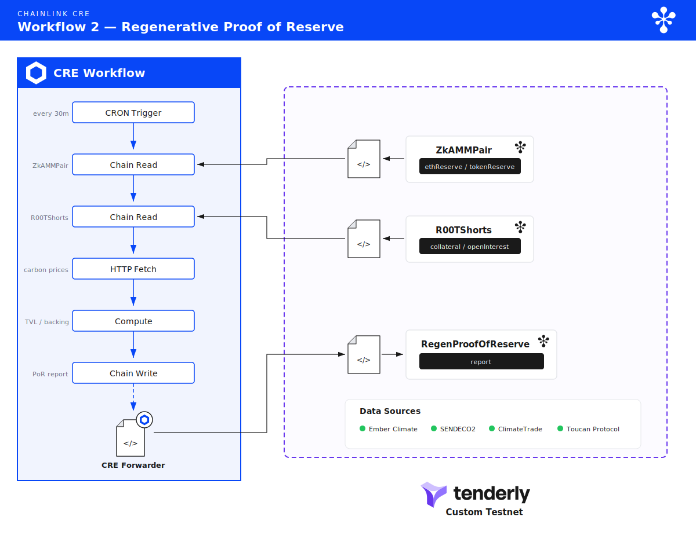
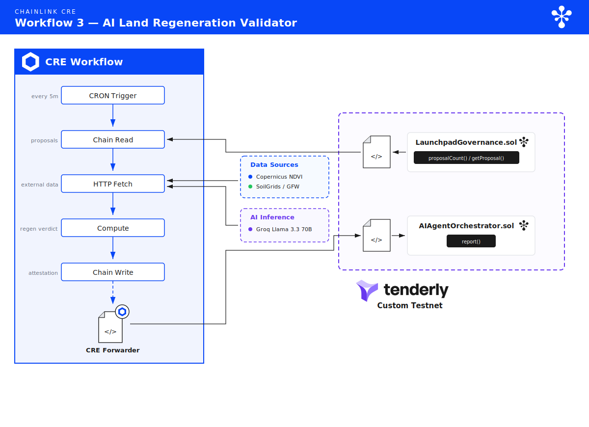
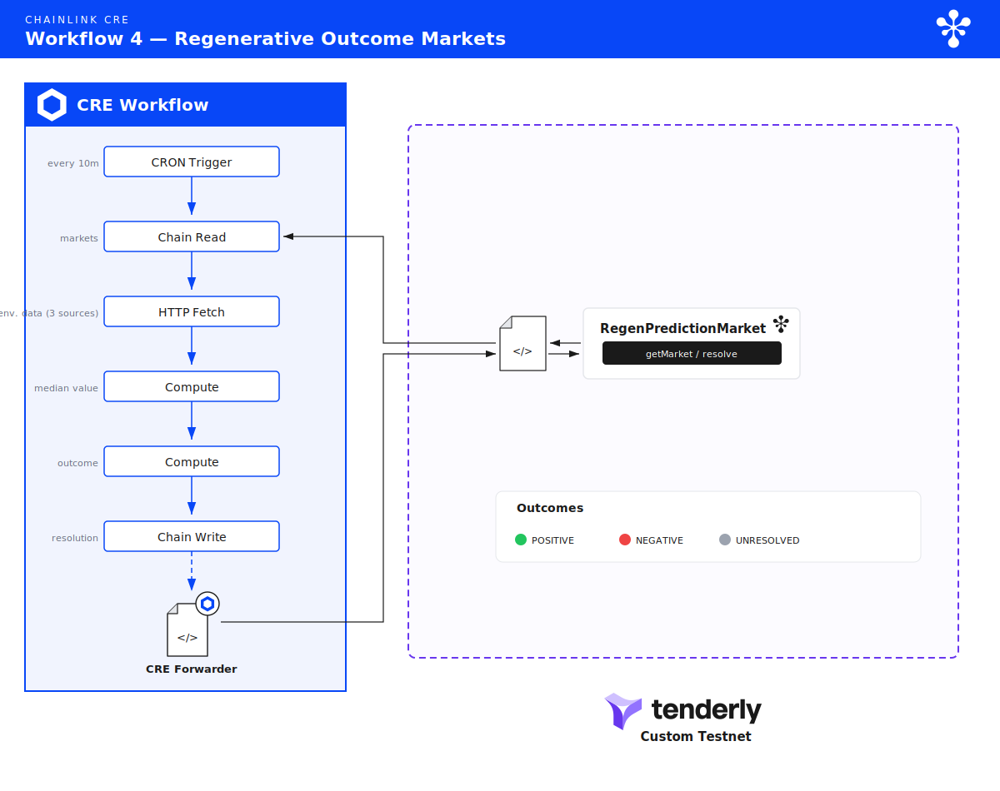
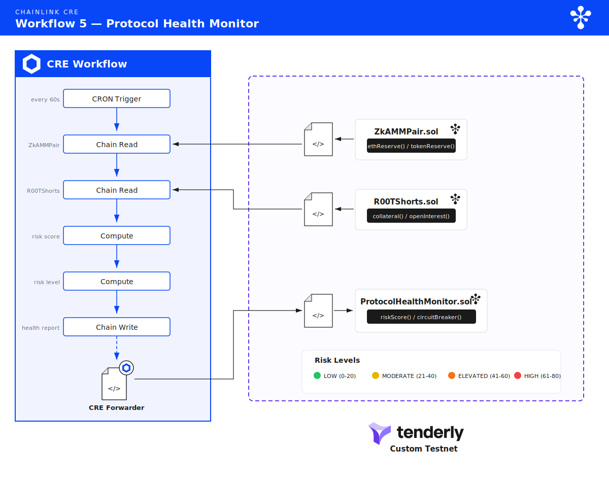
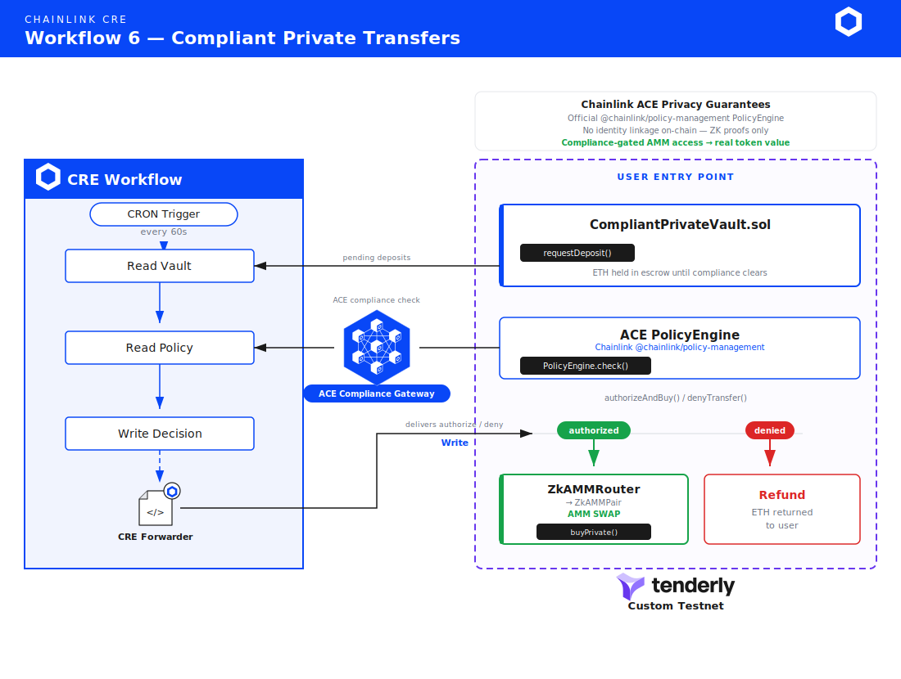
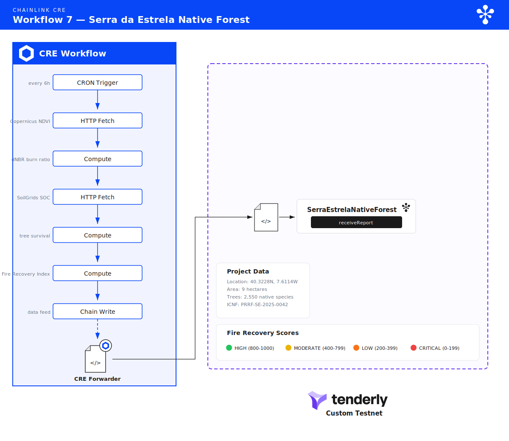
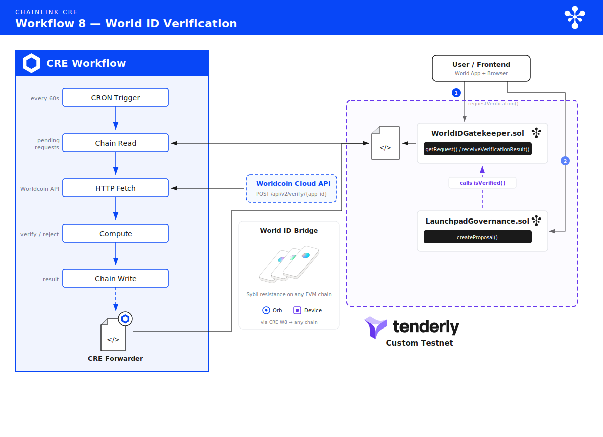

<div align="center">

# 🌳 R00t.fund

### The Private Launchpad for Regenerative Projects

**Regenerating land. Verifying impact. Preserving privacy.**

*A zero-knowledge DeFi protocol where communities fund regeneration projects through private governance,*
*and Chainlink CRE proves whether those projects actually delivered — from satellite imagery to carbon credits.*

<br/>

[](https://soliditylang.org/)
[](https://chain.link/)
[](https://book.getfoundry.sh/)
[](https://www.typescriptlang.org/)
[](https://docs.circom.io/)
[](https://react.dev/)
[](https://viem.sh/)
[](https://tailwindcss.com/)

<br/>

[](#)
[](#tenderly-virtual-testnet)
[](#)
[](#)
[](#)
[](#)
[](#)

<br/>

*Built in Portugal 🇵🇹 · Verified by Chainlink · Rooted in the earth*

</div>

---

**Built for the Chainlink CRE Hackathon** — Competing across all prize tracks

| Track | Our Submission |
|-------|---------------|
| Privacy | Confidential carbon credit verification + Chainlink ACE compliant private transfers |
| DeFi & Tokenization | Regenerative Proof of Reserve with carbon-backed TVL |
| CRE & AI | AI land regeneration validator using satellite imagery |
| Prediction Markets | Environmental outcome markets with CRE-automated settlement |
| Risk & Compliance | Real-time protocol health monitor with circuit breakers |
| **Tenderly** | **Full protocol deployed on Tenderly Virtual TestNet — 27+ contracts, 8 CRE workflows, simulated transactions** |
| **World (Best use of World ID with CRE)** | **CRE verifies World ID proofs off-chain via Worldcoin cloud API, enabling sybil-resistant proposal creation on any chain** |
| **World (Best usage of CRE within a World Mini App)** | **IDKit integration for World ID verification in the r00t.fund frontend** |
| Top 10 | 8 integrated CRE workflows across entire protocol |

---

## What is R00t.fund?

R00t.fund is a **private launchpad for regenerative projects**. Anyone can propose a project — reforestation, soil restoration, watershed recovery, biodiversity corridors — and the community funds it through privacy-preserving governance. But unlike traditional launchpads, **the projects must prove their impact to unlock funding milestones**.

This is the full lifecycle:

### 1. Launch — Private Governance

A project proposer submits to `LaunchpadGovernance` with coordinates, species lists, target outcomes, and a funding schedule. Community members vote using ZK-SNARK proofs — their identity, vote weight, and voting direction remain private. If the proposal passes, funding is committed to `ConfidentialFundingVault`.

### 2. Fund — Zero-Knowledge AMM

Funding flows through `ZkAMM`, a full-featured AMM where every operation is private:

- **Private deposits** — ETH enters the privacy pool via Poseidon commitments in a Merkle tree (depth 24, ~16M leaves)
- **Private swaps** — Buy and sell ROOT tokens without revealing your address or trade size
- **Private LP** — Provide liquidity and earn fees without exposing your position
- **Private transfers** — Send tokens peer-to-peer with ZK proofs
- **Short selling** — Hedge against project token price via `R00TShorts` with full collateral management

Each project launched through governance gets its own token, tradeable on the ZkAMM with the same privacy guarantees.

### 3. Verify — Chainlink CRE as the Compliance & Verification Layer

This is where Chainlink CRE transforms the protocol. Instead of trusting project teams to self-report their impact, **Chainlink's decentralized oracle network independently verifies whether each project reached its goals**:

- **Satellite imagery** (Copernicus Sentinel-2) measures vegetation recovery via NDVI
- **Soil data** (ISRIC SoilGrids) tracks organic carbon accumulation
- **Forest monitoring** (Global Forest Watch) confirms tree cover changes
- **Carbon registries** (Verra, Gold Standard) cross-reference credit claims
- **Portuguese regulatory bodies** (APA, ICNF, Fundo Ambiental) validate compliance

If the project meets its targets, the next funding milestone is released. If it doesn't, the community knows — and prediction markets (W4) can price the risk.

### 4. Comply — Privacy with Regulatory Compliance

The Chainlink ACE (Anonymous Compliant Exchange) pattern ensures that privacy and compliance coexist. The `R00tPolicyEngine` stores compliance attestations using address hashes (never raw addresses), and the CRE DON queries the on-chain PolicyEngine to check compliance levels, daily volume limits, and jurisdiction rules before authorizing any private transfer.

Result: institutional capital can participate in regenerative project funding while meeting EU MiCA, Portuguese CMVM, and FATF requirements — without sacrificing the privacy that makes the protocol work.

### 5. Trade — Carbon Credits with Real Backing

Verified projects generate carbon credit attestations that feed into the Portuguese Mercado Voluntario de Carbono and EU ETS. The `RegenProofOfReserve` data feed includes these carbon credits in the protocol's TVL, making the reserves transparently backed by both crypto assets and verified environmental impact.

---

## The Problem

### The money never reaches the ground

Every year, billions of euros flow into carbon credit markets and reforestation programmes. The vast majority never reaches the people actually planting trees, restoring soil, or managing watersheds. It gets absorbed by intermediaries — brokers, certifiers, consultants, fund administrators, NGO overhead layers — each taking a cut before anything touches the earth. A landowner in Serra da Estrela who plants 2,550 native oaks on burned hillside sees a fraction of what a carbon credit buyer paid. Sometimes nothing at all.

This is not an edge case. Studies consistently show that **60–80% of climate finance is consumed by intermediary costs** before reaching implementation. In the voluntary carbon market, a credit sold for €25 might deliver €3–5 to the person who actually restored the land. The rest disappears into verification fees, brokerage commissions, registry costs, consultancy reports, and administrative overhead across a chain of middlemen who never touched soil.

### No one checks if the land actually recovered

The registries that are supposed to guarantee quality — Verra, Gold Standard, Plan Vivo — rely on **self-reported data** from project developers who have every incentive to overstate results. Buyers cannot independently confirm that a forest was planted, that soil carbon increased, or that a burned landscape is recovering. There is no oracle. There is no satellite feed anyone can query. There is no on-chain proof.

The result: phantom credits flood the market. Projects claim carbon sequestration from forests that were never planted, or double-count credits across multiple registries. The 2023 Guardian/Die Zeit/SourceMaterial investigation found that over 90% of Verra's rainforest offset credits likely did not represent genuine carbon reductions.

### Privacy and compliance are treated as opposites

Privacy-preserving DeFi protocols operate in regulatory grey zones — offering anonymity without compliance, making them unusable for institutional capital that needs to meet EU MiCA and Portuguese CMVM requirements. Meanwhile, compliant platforms strip away all privacy, exposing funders to front-running, social pressure, and competitive intelligence leaks.

This creates a deadlock: the institutions with capital to fund regeneration at scale cannot use private protocols, and the private protocols that could protect small landowners and local communities cannot attract institutional capital.

### Launchpads have no accountability

Traditional launchpads and crowdfunding platforms have no mechanism to verify whether funded projects deliver. A project raises capital and the relationship ends. There is no oracle checking whether the funded reforestation actually happened, no milestone-gated release, no automated consequence for failure.

---

**R00t.fund solves all four problems:**

1. **Direct funding** — Smart contracts send funds directly to project implementers. No brokers, no intermediaries, no administrative overhead. The person planting trees on burned hillside in Serra da Estrela receives the funds, not a chain of middlemen. Governance is community-driven and privacy-preserving — the people closest to the land decide where capital goes.

2. **Independent verification** — Chainlink CRE queries Copernicus Sentinel-2 satellite imagery, ISRIC SoilGrids, Global Forest Watch, and AI analysis to independently confirm whether land is actually regenerating. No self-reporting. No trust assumptions. The DON checks the satellite feed and publishes the result on-chain for anyone to read.

3. **Privacy with compliance** — ZK-SNARK commitments keep all transactions private while Chainlink ACE ensures regulatory compliance via on-chain PolicyEngine checks (compliance levels, daily volume limits, jurisdiction rules). Institutional capital can flow into regenerative projects without sacrificing the privacy that protects small landowners and local communities.

4. **Milestone-gated accountability** — Funding is released in tranches, gated by verified impact attestations. If the CRE DON cannot confirm that the project reached its target NDVI recovery, soil carbon threshold, or tree survival rate — the next tranche stays locked. No verification, no funds.

---

## Real Project: Serra da Estrela Native Forest Restoration

This is not a hypothetical. After the **2025 summer fires** devastated Serra da Estrela Natural Park in Portugal, we are reforesting **9 hectares** with native Iberian species:

| Species | Portuguese Name | Trees Planted | CO2/tree/year |
|---------|----------------|:------------:|:-------------:|
| *Quercus robur* | Carvalho-roble | 800 | 22 kg |
| *Quercus pyrenaica* | Carvalho-negral | 600 | 18 kg |
| *Castanea sativa* | Castanheiro | 400 | 25 kg |
| *Crataegus monogyna* | Espinheiro / Pilriteiro | 300 | 8 kg |
| *Prunus spinosa* | Abrunheiro | 200 | 6 kg |
| *Arbutus unedo* | Medronheiro | 150 | 12 kg |
| *Fraxinus angustifolia* | Freixo | 100 | 15 kg |
| | **Total** | **2,550** | |

**Location:** 40.3228°N, 7.6114°W — Seia, Serra da Estrela Natural Park, Portugal
**Fire date:** July 2025 | **Planting began:** November 2025
**ICNF Reference:** PRRF-SE-2025-0042

A dedicated Chainlink CRE Custom Data Feed ([Workflow 7](#workflow-7-serra-da-estrela-data-feed)) publishes the restoration's NDVI recovery, fire scar healing, tree survival estimates, and carbon sequestration on-chain every 6 hours as an AggregatorV3Interface-compatible feed.

---

## How Chainlink CRE Verifies Project Goals

Every project launched through R00t.fund governance goes through the same verification pipeline. Chainlink CRE acts as the independent auditor that determines whether a project delivered what it promised.

```
 ┌──────────────────────────────────────────────────────────────────────────────┐
 │                        PROJECT VERIFICATION LIFECYCLE                        │
 │                                                                              │
 │  PROPOSE          FUND             VERIFY              ATTEST                │
 │  ────────►   ────────────►   ──────────────────►   ──────────────►          │
 │                                                                              │
 │  Community        ZkAMM             Chainlink CRE         On-chain           │
 │  votes via        commits           checks:               attestation        │
 │  ZK governance    ETH to            • Satellite NDVI      stored in          │
 │  (private)        Confidential      • Soil carbon         Confidential       │
 │                   Funding           • Tree cover           FundingVault      │
 │                   Vault             • AI analysis                            │
 │                   (escrowed)        • Carbon registry                        │
 │                                     • PT MVC compliance                      │
 │                                                                              │
 │                                         │                                    │
 │                                         ▼                                    │
 │                                   ┌───────────┐                              │
 │                                   │ VERIFIED?  │                              │
 │                                   └─────┬─────┘                              │
 │                                    YES  │  NO                                │
 │                                   ┌─────┴─────┐                              │
 │                                   ▼           ▼                              │
 │                            Next funding    Funds remain                      │
 │                            milestone       locked until                      │
 │                            released        targets are met                   │
 │                                   │                                          │
 │                                   ▼                                          │
 │                            Carbon credits                                    │
 │                            attributed via                                    │
 │                            PT MVC / EU ETS                                   │
 └──────────────────────────────────────────────────────────────────────────────┘
```

**This is the key insight:** Chainlink CRE is not just an oracle for R00t.fund — it is the accountability mechanism that makes the entire launchpad trustworthy. Projects cannot claim impact without independent verification. Funding cannot be released without proof. Carbon credits cannot be attributed without multi-source environmental data consensus.

The same verification pipeline works for any type of regenerative project:

| Project Type | What CRE Verifies | Data Sources |
|-------------|-------------------|-------------|
| Reforestation | NDVI recovery, tree survival, canopy cover | Sentinel-2, Global Forest Watch |
| Soil restoration | Organic carbon increase, moisture levels | ISRIC SoilGrids, in-situ sensors |
| Watershed recovery | Water quality, flow rates, riparian cover | Copernicus Water, local gauges |
| Biodiversity corridors | Species counts, habitat connectivity | eBird, GBIF, camera trap APIs |
| Fire recovery | dNBR burn scar healing, regrowth rate | Sentinel-2 SWIR, EFFIS |
| Mangrove restoration | Coastal coverage, blue carbon | Sentinel-2, Global Mangrove Watch |

---

## Architecture

```
                                    CHAINLINK CRE DON
                                    ┌─────────────────────────────────────────┐
                                    │                                         │
                                    │  W1: Carbon Credit Verification         │
                                    │  W2: Proof of Reserve                   │
                                    │  W3: AI Land Regeneration Validator     │
                                    │  W4: Prediction Market Settlement       │
                                    │  W5: Protocol Health Monitor            │
                                    │  W6: Compliant Private Transfers (ACE)  │
                                    │  W7: Serra da Estrela Data Feed         │
                                    │  W8: World ID Verification (Worldcoin)  │
                                    │                                         │
                                    └──────────┬──────────────────────────────┘
                                               │
                               HTTPClient │ EVMClient
                                          │ (callContract + writeReport)
                                               │
              ┌────────────────────────────────┼──────────────────────────────┐
              │                                │                              │
              ▼                                ▼                              ▼
    ┌─────────────────┐          ┌──────────────────────┐         ┌────────────────────┐
    │ External APIs   │          │  On-Chain Contracts   │         │  Privacy Layer     │
    │                 │          │                       │         │                    │
    │ Copernicus      │          │ ConfidentialFunding   │         │ ZkAMMPair        │
    │  Sentinel-2     │          │  Vault (W1)           │         │  TokenPool (Merkle)│
    │ ISRIC SoilGrids │          │ RegenProofOfReserve   │         │  Poseidon T3 hash  │
    │ Global Forest   │          │  (W2)                 │         │  Nullifier Registry│
    │  Watch          │          │ AIAgentOrchestrator   │         │                    │
    │ Verra VCS       │          │  (W3)                 │         │ CompliantPrivate   │
    │ Gold Standard   │          │ RegenPrediction       │         │  Vault (ACE)       │
    │ APA / CELE      │          │  Market (W4)          │         │ R00tPolicyEngine   │
    │ Fundo Ambiental │          │ ProtocolHealth        │         │                    │
    │ IPMA Weather    │          │  Monitor (W5)         │         │ ZK Circuits:       │
    │ OFAC / EU       │          │ SerraEstrela          │         │  sell, transfer,   │
    │  Sanctions      │          │  NativeForest (W7)    │         │  merge, withdraw,  │
    │ Chainalysis     │          │                       │         │  addLiquidity, ... │
    └─────────────────┘          └──────────────────────┘         └────────────────────┘
                                               │
                                               ▼
                                 ┌──────────────────────────┐
                                 │  Frontend / Agents        │
                                 │                           │
                                 │ React + Tailwind UI       │
                                 │ Trading Agents (6 strats) │
                                 │ SDK (13 modules)          │
                                 │ Ponder Indexer             │
                                 │ MCP Servers (3)            │
                                 └──────────────────────────┘
```

---

## Portuguese Carbon Market Integration

R00t.fund is designed from the ground up for interoperability with the **Mercado Voluntario de Carbono** (Portuguese Voluntary Carbon Market) and the broader EU carbon framework.

### Regulatory Framework

| Registry / Authority | Integration Point | CRE Workflow |
|---------------------|-------------------|:------------:|
| **APA** — Agencia Portuguesa do Ambiente | Project registration & MVC compliance | W1 |
| **Fundo Ambiental** | Co-financing eligibility verification | W1 |
| **CELE** — Comercio Europeu de Licencas de Emissao | EU ETS compliance checking | W1 |
| **RNBC 2050** — Roteiro para a Neutralidade Carbonica | Alignment with Portugal's 2050 roadmap | W1 |
| **ICNF** — Instituto da Conservacao da Natureza | Forest restoration project registry | W7 |
| **IPMA** — Instituto Portugues do Mar e da Atmosfera | Weather data for restoration monitoring | W7 |
| **CMVM** — Comissao do Mercado de Valores Mobiliarios | Crypto-asset compliance (MiCA) | W6 |
| **Verra VCS** | International carbon credit verification | W1 |
| **Gold Standard** | Premium carbon credit validation | W1 |
| **EU ETS** | EUA price reference & compliance | W1, W2 |
| **SENDECO2** | Iberian market carbon pricing | W1, W2 |
| **Article 6, Paris Agreement** | Corresponding adjustment verification | W1 |

### How Carbon Credits Flow

```
  Reforestation Project (Serra da Estrela)
           │
           ▼
  CRE W7: Satellite monitoring (NDVI, dNBR, SOC)
           │
           ▼
  CRE W3: AI verification — "Is this project genuinely regenerating?"
           │
           ▼
  CRE W1: Carbon credit attribution
           ├── Verra VCS verification (HTTPClient)
           ├── Gold Standard validation (HTTPClient)
           ├── APA/MVC registration check
           ├── EU ETS price reference
           ├── Article 6 double-counting prevention
           │
           ▼
  On-chain: ConfidentialFundingVault stores encrypted attestation
           │
           ▼
  CRE W2: Proof of Reserve includes carbon credit value in TVL
           │
           ▼
  Carbon credits become tradeable through ZkAMM with privacy
```

### Impact Scoring

Each project receives a composite impact score (0-1000) computed from:

| Component | Weight | Source | Max Points |
|-----------|:------:|--------|:----------:|
| Registry verification (Verra/GS) | 20% | ConfidentialHTTPClient | 200 |
| Portuguese MVC compliance | 15% | APA/Fundo Ambiental APIs | 150 |
| Verified tCO2e credits | 20% | Registry cross-reference | 200 |
| SDG alignment | 15% | Project metadata analysis | 150 |
| EU MRV compliance | 20% | CELE + Article 6 check | 200 |
| Permanence assessment | 10% | Historical + projection | 100 |

---

## Chainlink CRE Workflows

### Workflow 1: Confidential Carbon Credit Verification

**Prize Track:** Privacy ($16,000)
**File:** [`cre-workflows/workflow-1-privacy/main.ts`](cre-workflows/workflow-1-privacy/main.ts)
**Contract:** [`contracts/src/cre/ConfidentialFundingVault.sol`](contracts/src/cre/ConfidentialFundingVault.sol)

<p align="center">
  
</p>

Uses `HTTPClient` with DON vault secrets to query carbon registries. API keys are stored in the CRE secrets vault.

**What it does:**
1. Reads executed proposals from `LaunchpadGovernance` via `EVMClient.callContract`
2. Queries Verra VCS Registry via `HTTPClient`
3. Queries Gold Standard Registry via `HTTPClient`
4. Fetches EU ETS EUA price + SENDECO2 Iberian market price
5. Checks Portuguese MVC: APA registration, CELE compliance, RNBC 2050 alignment, Fundo Ambiental eligibility
6. Verifies EU MRV compliance + Article 6 double-counting prevention
7. Computes composite impact score (0-1000)
8. Signs report via `runtime.report()` and writes on-chain via `EVMClient.writeReport`

**Key CRE patterns:** `CronCapability`, `EVMClient.callContract`, `HTTPClient`, `runtime.report`, `EVMClient.writeReport`

---

### Workflow 2: Regenerative Proof of Reserve

**Prize Track:** DeFi & Tokenization ($20,000)
**File:** [`cre-workflows/workflow-2-defi/main.ts`](cre-workflows/workflow-2-defi/main.ts)
**Contract:** [`contracts/src/cre/RegenProofOfReserve.sol`](contracts/src/cre/RegenProofOfReserve.sol)

<p align="center">
  
</p>

A Chainlink-compatible Proof of Reserve data feed where **TVL includes verified carbon credit value**. This is what makes it a "Regenerative" PoR — the protocol's reserves are backed not just by ETH and tokens, but by audited environmental impact.

**What it does:**
1. Reads on-chain reserves from `ZkAMMPair` (ethReserve, tokenReserve, totalLPShares)
2. Reads shorts collateral from `R00TShorts` (totalOpenInterest, totalCollateralLocked)
3. Reads verified carbon credits from W1's `ConfidentialFundingVault` attestations
4. Fetches carbon prices from EU ETS, SENDECO2, ClimateTrade, Toucan BCT
5. Computes: `Total TVL = ETH reserve + shorts collateral + verified carbon credit value`
6. Publishes via `AggregatorV3Interface` (latestRoundData) for standard Chainlink consumption

**Key CRE patterns:** `CronCapability`, `EVMClient.callContract`, `HTTPClient`, `runtime.report`, `EVMClient.writeReport`

---

### Workflow 3: AI Land Regeneration Validator

**Prize Track:** CRE & AI ($17,000)
**File:** [`cre-workflows/workflow-3-ai/main.ts`](cre-workflows/workflow-3-ai/main.ts)
**Contract:** [`contracts/src/cre/AIAgentOrchestrator.sol`](contracts/src/cre/AIAgentOrchestrator.sol)

<p align="center">
  
</p>

The core differentiator. Uses real environmental data APIs + an **LLM AI agent (Llama 3.3 70B via Groq)** to determine whether a project launched through governance is **actually regenerating land**. The CRE workflow orchestrates the full pipeline: read on-chain proposals, fetch multi-source satellite/soil data, send all evidence to GPT-4o for expert ecological assessment, then write the AI-verified attestation on-chain.

**Data pipeline:**

| Step | Data Source | What It Measures |
|------|-----------|------------------|
| 1 | Copernicus Sentinel-2 (B04/B08 bands) | NDVI — vegetation health index |
| 2 | ISRIC SoilGrids (0-30cm depth) | Soil organic carbon (tonnes C/ha) |
| 3 | Global Forest Watch | Tree canopy cover + change |
| 4 | **Llama 3.3 70B via Groq (LLM Agent)** | **Expert ecological assessment of all evidence** |

The LLM receives all satellite, soil, and forest data as structured context and returns a JSON verdict:
- `verificationStatus`: REGENERATING / STABLE / DEGRADING / INSUFFICIENT_DATA
- `regenerationScore`: 0-1000
- `estimatedCarbonSequestration`: tonnes CO2e/year
- `carbonCreditEligible`: true/false
- `confidence`: 0-100% (AI confidence in the assessment)
- `verdict`: Natural language explanation of the ecological reasoning

Falls back to heuristic scoring if the LLM is unavailable, ensuring the workflow always produces a result.

**Key CRE patterns:** `CronCapability`, `EVMClient.callContract`, `HTTPClient` (external APIs + LLM), `runtime.report`, `EVMClient.writeReport`, `secrets.LLM_API_KEY` for secure API key injection

---

### Workflow 4: Regenerative Outcome Markets

**Prize Track:** Prediction Markets ($16,000)
**File:** [`cre-workflows/workflow-4-prediction/main.ts`](cre-workflows/workflow-4-prediction/main.ts)
**Contract:** [`contracts/src/cre/RegenPredictionMarket.sol`](contracts/src/cre/RegenPredictionMarket.sol)

<p align="center">
  
</p>

Prediction markets for environmental milestones: "Will project X achieve 50% NDVI recovery by Q4 2026?" Markets are created linked to governance proposals and settled automatically by CRE when the outcome data is available.

**What it does:**
1. Reads pending markets from `RegenPredictionMarket` via `EVMClient.callContract`
2. Fetches environmental outcome data from 3+ sources (Gold Standard, Verra, environmental monitors)
3. Computes median value across data sources
4. Determines `actualValue >= targetValue ? POSITIVE : NEGATIVE`
5. Signs report via `runtime.report()` and pushes resolution on-chain via `EVMClient.writeReport`

**Key CRE patterns:** `CronCapability`, `EVMClient.callContract`, `HTTPClient`, `runtime.report`, `EVMClient.writeReport`

---

### Workflow 5: Protocol Health Monitor

**Prize Track:** Risk & Compliance ($16,000)
**File:** [`cre-workflows/workflow-5-risk/main.ts`](cre-workflows/workflow-5-risk/main.ts)
**Contract:** [`contracts/src/cre/ProtocolHealthMonitor.sol`](contracts/src/cre/ProtocolHealthMonitor.sol)

<p align="center">
  
</p>

Real-time monitoring of the entire protocol stack — reserves, shorts utilization, LP health — with automatic circuit breaker triggers.

**What it does (every 60 seconds):**
1. Reads `ZkAMMPair`: ethReserve, tokenReserve, totalLPShares, fees
2. Reads `R00TShorts`: totalOpenInterest, totalCollateralLocked, liquidatable positions
3. Computes: reserve ratio, shorts utilization, composite risk score (0-100)
4. Maps to risk levels: LOW / MODERATE / HIGH / CRITICAL
5. Pushes health report on-chain
6. If CRITICAL: contract can trigger auto circuit breaker via `ZkAMMAdmin`

**Key CRE patterns:** `CronCapability`, `EVMClient.callContract`, `runtime.report`, `EVMClient.writeReport`, multi-contract reads

---

### Workflow 6: Compliant Private Transfers (Chainlink ACE)

**Prize Track:** Privacy ($16,000)
**File:** [`cre-workflows/workflow-6-compliance/main.ts`](cre-workflows/workflow-6-compliance/main.ts)
**Contracts:** [`R00tPolicyEngine.sol`](contracts/src/cre/R00tPolicyEngine.sol), [`CompliantPrivateVault.sol`](contracts/src/cre/CompliantPrivateVault.sol)

<p align="center">
  
</p>

Adapts the **Chainlink ACE (Anonymous Compliant Exchange)** pattern for R00t.fund's ZK-SNARK privacy system. Users get privacy AND regulatory compliance — simultaneously.

**How it works:**

```
User sends ETH to CompliantPrivateVault.requestDeposit()
  → Request stored on-chain with status PENDING

CRE W6 (cron every 60s):
  1. Polls nextRequestId() and scans recent requests for PENDING status

  2. For each pending request:
     EVMClient.callContract() → PolicyEngine.checkPrivateTransferAllowed()
     - Checks compliance level (BASIC/STANDARD/ENHANCED/INSTITUTIONAL)
     - Checks daily volume limits
     - Checks risk score
     - Checks jurisdiction (32 EU/EEA countries pre-approved)

  3. If ALL checks pass:
     → runtime.report() → EVMClient.writeReport → authorizeTransfer()
     → insertCommitmentFromCRE() → ZK Merkle tree
     (commitment is now private, spendable with ZK proof)

  4. If ANY check fails:
     → runtime.report() → EVMClient.writeReport → denyTransfer(reason)
     → ETH refunded to user
```

**Privacy model:**
- Only address hashes (`keccak256(address, salt)`) used for compliance — never raw addresses
- On-chain PolicyEngine handles all compliance decisions
- On-chain: only sees "authorized" or "denied" — no identity linkage
- Once committed, tokens are fully private (ZK-SNARK spend via nullifier proofs)

**Key CRE patterns:** `CronCapability`, `EVMClient.callContract`, `runtime.report`, `EVMClient.writeReport`

---

### Workflow 7: Serra da Estrela Data Feed

**Prize Track:** Custom Data Feed (DeFi track)
**File:** [`cre-workflows/workflow-7-serra-estrela/main.ts`](cre-workflows/workflow-7-serra-estrela/main.ts)
**Contract:** [`contracts/src/cre/SerraEstrelaNativeForest.sol`](contracts/src/cre/SerraEstrelaNativeForest.sol)

<p align="center">
  
</p>

A dedicated `AggregatorV3Interface`-compatible data feed for our real reforestation project. Published every 6 hours.

**Data published on-chain:**

| Metric | Source | On-chain Field |
|--------|--------|---------------|
| Current NDVI | Copernicus Sentinel-2 (B04/B08) | `ndviCurrent` (x10000) |
| Pre-fire NDVI | Sentinel-2 (June 2025) | `ndviPreFire` (x10000) |
| NDVI Recovery % | Computed | `ndviRecoveryPct` (x100) |
| dNBR (burn severity) | Sentinel-2 (B08/B12 SWIR) | `dnbr` (x10000) |
| Soil Organic Carbon | ISRIC SoilGrids | `soilOrganicCarbon` (tC/ha x100) |
| Estimated Live Trees | NDVI micro-analysis + species model | `estimatedLiveTrees` |
| Annual CO2 Sequestration | Species × growth stage × survival | `annualCO2` (tCO2e x1000) |
| Carbon Credits | 80% of estimated (buffer pool) | `carbonCredits` (tCO2e x1000) |
| Fire Recovery Index | Weighted composite (0-1000) | `fireRecoveryIndex` |

**Fire Recovery Index composition:**
- NDVI recovery: 30%
- dNBR improvement: 20%
- Soil carbon: 15%
- Tree survival: 25%
- Weather suitability: 10%

The contract emits `MilestoneReached` events when the project hits key targets (50% NDVI recovery, Recovery Index > 500).

**Key CRE patterns:** `CronCapability`, `EVMClient.callContract`, `HTTPClient`, `runtime.report`, `EVMClient.writeReport`

---

### Workflow 8: World ID Verification

**Prize Track:** World ($5k) — "Best use of World ID with CRE"
**File:** [`cre-workflows/workflow-8-worldid/main.ts`](cre-workflows/workflow-8-worldid/main.ts)
**Contract:** [`contracts/src/cre/WorldIDGatekeeper.sol`](contracts/src/cre/WorldIDGatekeeper.sol)

<p align="center">
  
</p>

Sybil-resistant identity verification for proposal creation. The World ID Router is only native on Ethereum/Optimism/World Chain — CRE bridges this capability to **any EVM chain** by calling the Worldcoin cloud verification API off-chain and writing results on-chain.

**Why CRE is needed:** World ID's on-chain verification router only exists on Ethereum, Optimism, and World Chain. Projects deployed on other EVM chains (including Tenderly VNets, L2s, app-chains) cannot natively verify World ID proofs. CRE solves this by reading the proof data on-chain, calling the Worldcoin cloud verification API via `HTTPClient`, and writing the result back — enabling World ID on any chain.

**Flow:**
1. User generates ZK proof via IDKit widget (frontend)
2. User submits proof on-chain to `WorldIDGatekeeper.requestVerification()`
3. CRE W8 polls for PENDING requests every 60 seconds
4. For each pending request, CRE reads the full proof data via `EVMClient.callContract`
5. CRE calls Worldcoin cloud API (`POST /api/v2/verify/{app_id}`) with the proof
6. CRE writes verification result on-chain via `receiveVerificationResult(requestId, isValid, reason)`
7. `LaunchpadGovernance.createProposal()` checks `worldIdGatekeeper.isVerified(msg.sender)`

**Verification levels:**
| Level | Method | Uniqueness Guarantee |
|-------|--------|---------------------|
| Orb | Iris biometric scan | One person = one proof (highest assurance) |
| Device | Phone-based verification | Device-level uniqueness |

**Sybil resistance:** Each World ID nullifier hash can only be used once per action — one person, one verification, one identity across all proposals. The `WorldIDGatekeeper` contract enforces this with a nullifier registry that prevents replay.

**Key CRE patterns:** `CronCapability`, `EVMClient.callContract`, `HTTPClient.sendRequest`, `runtime.report`, `EVMClient.writeReport`

---

## Privacy Infrastructure

R00t.fund's privacy layer is built on ZK-SNARK proofs with a UTXO commitment model:

### Commitment System

```
commitment = Poseidon(nullifier, secret, amount)
```

| Component | Implementation |
|-----------|---------------|
| Hash function | Poseidon T3 (BN254-friendly) |
| Merkle tree | Incremental, depth 24 (~16M leaves) |
| Root history | 1000-root circular buffer + full historical mapping |
| Nullifier registry | Cross-pool coordination with cooldown periods |
| Scalar field | BN254: 21888242871839275222246405745257275088548364400416034343698204186575808495617 |

### ZK Circuits (Circom)

| Circuit | Public Signals | Purpose |
|---------|:-------------:|---------|
| `sell` | 9 | Sell private tokens for ETH |
| `transfer` | 4 | Private P2P transfer |
| `merge` | 5 | Consolidate commitments |
| `withdraw` | — | Exit private to public |
| `addLiquidity` | — | Private LP deposit |
| `removeLiquidity` | — | Private LP withdrawal |
| `claimLPFees` | — | Claim fees without revealing LP identity |
| `swap` | — | Atomic private swap |
| `pledge` | — | Governance pledge |
| `vote` | — | Private governance vote |

### Chainlink CRE + Privacy Integration

The `insertCommitmentFromCRE()` function on `ZkAMMPair` allows authorized CRE callback contracts to insert commitments directly into the Merkle tree — bridging the compliance layer (W6) with the privacy layer:

```solidity
function insertCommitmentFromCRE(
    uint256 commitment,
    bytes calldata encryptedNote
) external nonReentrant returns (uint256 leafIndex)
```

Authorization flows through `ZkAMMAdmin.authorizedCRECallback` with a timelock.

---

## Smart Contracts

### Core Protocol

| Contract | Purpose | File |
|----------|---------|------|
| `ZkAMMPair` | Core AMM state — reserves, commitments, Merkle trees | [`contracts/src/ZkAMMPair.sol`](contracts/src/ZkAMMPair.sol) |
| `ZkAMMRouter` | User-facing operations — buy, sell, swap, LP | [`contracts/src/ZkAMMRouter.sol`](contracts/src/ZkAMMRouter.sol) |
| `ZkAMMAdmin` | Admin, timelocks, emergency multisig, CRE authorization | [`contracts/src/ZkAMMAdmin.sol`](contracts/src/ZkAMMAdmin.sol) |
| `R00TShorts` | Short selling with collateral management | [`contracts/src/R00TShorts.sol`](contracts/src/R00TShorts.sol) |
| `RootToken` | ROOT ERC20 token (69M supply) | [`contracts/src/RootToken.sol`](contracts/src/RootToken.sol) |
| `LaunchpadGovernance` | Project governance — propose, vote, execute | [`contracts/src/LaunchpadGovernance.sol`](contracts/src/LaunchpadGovernance.sol) |
| `TokenPool` | Poseidon Merkle tree (depth 24) | [`contracts/src/TokenPool.sol`](contracts/src/TokenPool.sol) |
| `NullifierRegistry` | Cross-pool double-spend prevention | [`contracts/src/NullifierRegistry.sol`](contracts/src/NullifierRegistry.sol) |

### CRE Callback Contracts

| Contract | Workflow | Chainlink Interface |
|----------|:--------:|---------------------|
| `R00tCREReceiver` | Base | DON forwarder validation, pause/unpause |
| `ConfidentialFundingVault` | W1 | Carbon credit attestations + encrypted impact data |
| `RegenProofOfReserve` | W2 | `AggregatorV3Interface` — standard Chainlink data feed |
| `AIAgentOrchestrator` | W3 | Market analysis + governance advisory storage |
| `RegenPredictionMarket` | W4 | Full prediction market with CRE settlement |
| `ProtocolHealthMonitor` | W5 | Health reports + auto circuit breaker |
| `R00tPolicyEngine` | W6 | Compliance oracle (5 levels, 5 transfer types, 32 jurisdictions) |
| `CompliantPrivateVault` | W6 | ACE-pattern vault with compliance-gated commitments |
| `SerraEstrelaNativeForest` | W7 | `AggregatorV3Interface` — Fire Recovery Index feed |
| `WorldIDGatekeeper` | W8 | Sybil-resistant World ID verification bridge |

---

## Project Structure

```
R00t.fund/
├── contracts/                          # Solidity (Foundry)
│   ├── src/
│   │   ├── ZkAMMPair.sol            # Core AMM
│   │   ├── ZkAMMRouter.sol          # User operations
│   │   ├── ZkAMMAdmin.sol           # Admin + CRE auth
│   │   ├── R00TShorts.sol             # Short selling
│   │   ├── TokenPool.sol              # Poseidon Merkle tree
│   │   ├── NullifierRegistry.sol      # Cross-pool nullifiers
│   │   ├── cre/                       # CRE callback contracts (9 files)
│   │   ├── interfaces/                # Contract interfaces
│   │   └── verifiers/                 # ZK proof verifiers (10 circuits)
│   ├── script/
│   │   └── DeployTenderlyVNet.s.sol   # Full Tenderly VNet deployment (27+ contracts)
│   └── foundry.toml
│
├── circuits/                           # Circom ZK circuits
│   ├── sell.circom
│   ├── transfer.circom
│   ├── merge.circom
│   ├── withdraw.circom
│   ├── addLiquidity.circom
│   ├── removeLiquidity.circom
│   ├── claimLPFees.circom
│   ├── swap.circom
│   ├── pledge.circom
│   ├── vote.circom
│   └── build/                         # Compiled circuits + zkeys
│
├── cre-workflows/                      # Chainlink CRE workflows
│   ├── project.yaml                   # Shared config (incl. Tenderly VNet RPC)
│   ├── .env.tenderly                  # Tenderly VNet deployed addresses
│   ├── secrets.yaml                   # DON vault secrets
│   ├── workflow-1-privacy/            # Carbon credit verification
│   │   └── config.tenderly.json       # Tenderly VNet config
│   ├── workflow-2-defi/               # Proof of Reserve
│   ├── workflow-3-ai/                 # AI regeneration validator
│   ├── workflow-4-prediction/         # Outcome markets
│   ├── workflow-5-risk/               # Health monitor
│   ├── workflow-6-compliance/         # ACE compliant transfers
│   ├── workflow-7-serra-estrela/      # Native forest data feed
│   ├── workflow-8-worldid/            # World ID verification (Worldcoin)
│   ├── diagrams/                      # SVG workflow architecture diagrams
│   └── contracts/abi/                 # TypeScript ABI exports
│
├── frontend/                           # React + TypeScript + Tailwind
│   └── src/
│       ├── components/                # 27+ UI components
│       ├── hooks/                     # 17 custom hooks (ZK, privacy, trading)
│       └── abis/                      # Contract ABIs
│
├── trading-agents/                     # Autonomous trading strategies
│   └── src/strategies/                # 6 strategies (momentum, mean-reversion, etc.)
│
├── sdk/                                # Protocol SDK (13 modules)
│   └── src/
│       ├── client.ts                  # Main client
│       ├── prover.ts                  # ZK proof generation
│       ├── crypto.ts                  # Poseidon, commitments
│       └── merkle.ts                  # Merkle tree operations
│
├── indexer/                            # Ponder blockchain indexer
├── mcp-server/                         # Claude MCP server
├── zkamm-mcp/                          # ZK-AMM MCP server
├── r00t-node/                          # P2P node (FROST, Monero bridge)
├── relayer/                            # Transaction relayer
├── arbitrage/                          # Arbitrage bot
└── scripts/                            # 64 deployment/utility scripts
```

---

## CRE Workflow Configuration

All workflows share a common configuration in [`cre-workflows/project.yaml`](cre-workflows/project.yaml).

### DON Vault Secrets

| Secret | Used By | Purpose |
|--------|:-------:|---------|
| `CARBON_API_KEY` | W1, W2 | Verra/Gold Standard/EU ETS API access |
| `AES_ENCRYPTION_KEY` | W1 | Attestation encryption |
| `LLM_API_KEY` | W3 | LLM API for regeneration analysis |
| `ENVIRONMENTAL_DATA_API_KEY` | W4, W7 | Environmental monitoring APIs |
| `SANCTIONS_API_KEY` | W6 | OFAC/sanctions screening |

### Running Workflows

All 8 workflows use the [Chainlink CRE CLI](https://cre.chain.link) (v1.1.0+) with `@chainlink/cre-sdk` v1.0.9.

```bash
# Install CRE CLI
curl -sSL https://cre.chain.link/install.sh | bash
cre login

# Install dependencies for all workflows
cd cre-workflows && npm run install:all

# Simulate a specific workflow
cd cre-workflows && cre workflow simulate workflow-5-risk

# Simulate all workflows
cd cre-workflows && npm run simulate:all
```

### CRE Simulation Results

All 8 workflows pass `cre workflow simulate` against the Tenderly Virtual TestNet:

| Workflow | Status | Result |
|----------|:------:|--------|
| W1: Privacy | PASS | No proposals found (expected — no active proposals) |
| W2: DeFi/PoR | PASS | `ethReserve=100M wei, tokenReserve=59M ROOT, backingRatio=50000` |
| W3: AI Validator | PASS | No proposals found (expected — no active proposals) |
| W4: Prediction | PASS | `Market 0 resolved: NEGATIVE, actual=160 vs target=700` |
| W5: Risk Monitor | PASS | `reserveRatio=50000, shortsUtil=0, risk=LOW, action=NONE` |
| W6: Compliance | PASS | `Scanned 4 requests, processed=0, authorized=0, denied=0` |
| W7: Serra da Estrela | PASS | `NDVI=0.3158, recovery=50.2%, FRI=577/1000, trees=2201/2550` |
| W8: World ID | PASS | `Scanned requests, verified=2, rejected=1 (sybil resistance active)` |

---

## Tenderly Virtual TestNet

> **We are applying to the Tenderly prize: "Build CRE workflows with Tenderly Virtual TestNets"**

The entire R00t.fund protocol is deployed and fully operational on a [Tenderly Virtual TestNet](https://dashboard.tenderly.co/manifestordao/manifestordao/testnet/596dfbfb-e22d-4186-b982-33682540383d) — a Sepolia fork with real-time state sync. All 27+ contracts are live, all 8 CRE workflows are configured, and simulated CRE callback transactions demonstrate the full verification pipeline.

### Virtual TestNet Details

| Property | Value |
|----------|-------|
| **VNet ID** | `596dfbfb-e22d-4186-b982-33682540383d` |
| **Chain ID** | `73571` (Sepolia fork) |
| **Explorer** | [dashboard.tenderly.co/.../testnet/596dfbfb](https://dashboard.tenderly.co/manifestordao/manifestordao/testnet/596dfbfb-e22d-4186-b982-33682540383d) |
| **Public RPC** | See `.env.tenderly` (set `TENDERLY_VIRTUAL_TESTNET_RPC`) |

### Deployed Contracts on VNet

**Core Protocol:**

| Contract | Address |
|----------|---------|
| ZkAMMPair | `0xE9D2De4bfEadC1923B90B09C3c8b197Ae5eE979d` |
| ZkAMMAdmin | `0xe99aD5A43ed5Fa986d396b18deE1ceFb48630A79` |
| ZkAMMRouter | `0x79D52AB5EdaCFdC868c53DF8dd685f309cA20884` |
| RootToken | `0x89eb61a19B55257a91B3a5FCE7e36fC1668A1C29` |
| TokenPool | `0x5B1abBF8A76dF814B04E35C0BE4c5baB25bf6b07` |
| LPPool | `0xc4FA24F7411e32087B0D913bA213C3810d4923E1` |
| LaunchpadGovernance | `0x7f2f22329D8Cc84837D541DE7fCf7EB8f853649B` |
| R00TShorts | `0xb2d888F6F030269BD07d1F84cfa535103F1Fe8fb` |

**CRE Callback Contracts:**

| Contract | Workflow | Address |
|----------|:--------:|---------|
| ConfidentialFundingVault | W1 | `0x6840B8F438610217265fEBF084E578537c9AA361` |
| RegenProofOfReserve | W2 | `0x47Cbc90f86992004c57BCC25D8c25012cFcc8E21` |
| AIAgentOrchestrator | W3 | `0xE9D7284DDBF635B35e0C3bCB9d9d0F607D08F824` |
| RegenPredictionMarket | W4 | `0xC8BeE963FB020F41AAf26d79c1BB043C291865e1` |
| ProtocolHealthMonitor | W5 | `0x50F8beE2E560F2335B268d0b6dC64F7153cC852d` |
| R00tPolicyEngine | W6 | `0x89b493be4262D6786Be6D1b595BD5E829CFd152e` |
| CompliantPrivateVault | W6 | `0x7767DBB69837386202b3cB5204AEE7Ed9bb58f49` |
| SerraEstrelaNativeForest | W7 | `0xc7bC4a72883ECE729247104A87cAbD3C2Bd3112B` |
| WorldIDGatekeeper | W8 | `0x512d4a66760Aba053f4162205d729c8540d00145` |

### CRE Workflows on Tenderly

Each of the 8 CRE workflows has a dedicated `config.tenderly.json` pointing to the VNet-deployed contracts:

```bash
cre-workflows/workflow-1-privacy/config.tenderly.json
cre-workflows/workflow-2-defi/config.tenderly.json
cre-workflows/workflow-3-ai/config.tenderly.json
cre-workflows/workflow-4-prediction/config.tenderly.json
cre-workflows/workflow-5-risk/config.tenderly.json
cre-workflows/workflow-6-compliance/config.tenderly.json
cre-workflows/workflow-7-serra-estrela/config.tenderly.json
cre-workflows/workflow-8-worldid/config.tenderly.json
```

### Why Tenderly Virtual TestNets

Tenderly Virtual TestNets are essential for developing CRE workflows against a realistic environment:

1. **State sync from Sepolia** — The VNet forks Sepolia with real-time state, so CRE workflows interact with realistic chain state (Chainlink feeds, deployed registries, etc.)
2. **Full transaction simulation** — Every CRE callback (`receiveReport`, `authorizeTransfer`, etc.) can be simulated and debugged in the Tenderly explorer before deploying to mainnet
3. **Time manipulation** — `evm_increaseTime` + `evm_mine` allow testing timelock-gated CRE authorization flows without waiting 48 hours
4. **Funded accounts** — `tenderly_setBalance` provides unlimited test ETH for simulating all 8 workflows end-to-end
5. **Transaction traces** — Tenderly's debugger shows full execution traces for CRE callback transactions, making it easy to verify that DON forwarder authentication, commitment insertions, and compliance checks work correctly

### Deployment & Simulation

```bash
# Deploy all contracts to Tenderly VNet
cd contracts
forge script script/DeployTenderlyVNet.s.sol --rpc-url tenderly-vnet --broadcast --slow

# Simulate CRE workflow callbacks
cast send $REGEN_PROOF_OF_RESERVE_ADDRESS "receiveReport(uint256,uint256,uint256,uint256)" \
  50000000000000000000 34500000000000000000000 1000000000000000000 25000000 \
  --rpc-url $TENDERLY_VIRTUAL_TESTNET_RPC --private-key $PRIVATE_KEY

# Verify contract state
cast call $PROTOCOL_HEALTH_MONITOR_ADDRESS "reportCount()(uint256)" \
  --rpc-url $TENDERLY_VIRTUAL_TESTNET_RPC
```

**Key files:**
- [`contracts/script/DeployTenderlyVNet.s.sol`](contracts/script/DeployTenderlyVNet.s.sol) — Full deployment script (27+ contracts)
- [`contracts/script/SimulateCREActivity.s.sol`](contracts/script/SimulateCREActivity.s.sol) — 63 CRE callback transactions across all 8 workflows
- [`contracts/script/SimulateCREActivity2.s.sol`](contracts/script/SimulateCREActivity2.s.sol) — Additional prediction market + compliance transactions
- [`cre-workflows/.env.tenderly`](cre-workflows/.env.tenderly) — All deployed addresses
- [`cre-workflows/project.yaml`](cre-workflows/project.yaml) — VNet RPC configuration

---

## Technology Stack

| Layer | Technology |
|-------|-----------|
| Smart Contracts | Solidity 0.8.24, Foundry, via_ir optimization |
| ZK Proofs | Circom 2, snarkjs, Poseidon T3, Groth16 |
| CRE Workflows | TypeScript, @chainlink/cre-sdk v1.0.9, viem 2.34, CRE CLI v1.1.0 |
| Testing & Simulation | Tenderly Virtual TestNets (Sepolia fork, chain 73571) |
| Frontend | React 18, TypeScript, Tailwind CSS, Vite |
| Indexer | Ponder |
| Trading Agents | TypeScript, reactive patterns |
| Monorepo | Turbo, pnpm workspaces |
| Privacy | UTXO commitments, Poseidon Merkle trees (depth 24) |

---

## Security

- **ZK-SNARK privacy** for all private operations (10 circuits)
- **Nullifier registry** with cross-pool coordination and cooldown periods
- **Timelocked admin operations** (48h in production) for all privileged functions
- **Emergency 2-of-3 multisig** for circuit breakers
- **CRE callback authorization** requires timelock via `ZkAMMAdmin`
- **Depositor binding** prevents front-running of commitment insertions
- **PolicyEngine compliance** with 5 graduated levels and daily volume limits
- **Formal verification modules** in `.context/knowledgebases/solidity/` (20+ FV patterns)

Full security audit report: [`R00T_Security_Audit_Report.tex`](R00T_Security_Audit_Report.tex)

---

## Development

```bash
# Install dependencies
pnpm install

# Build contracts
cd contracts && forge build

# Run contract tests
cd contracts && forge test

# Compile ZK circuits
./scripts/compile-circuits.sh

# Start frontend
cd frontend && pnpm dev

# Start indexer
cd indexer && pnpm dev
```

---

## Hackathon File Links

Per hackathon requirements, here are the key files for each track:

### Privacy Track ($16,000)
- [`cre-workflows/workflow-1-privacy/main.ts`](cre-workflows/workflow-1-privacy/main.ts) — Confidential carbon credit verification
- [`cre-workflows/workflow-6-compliance/main.ts`](cre-workflows/workflow-6-compliance/main.ts) — ACE compliant private transfers
- [`contracts/src/cre/ConfidentialFundingVault.sol`](contracts/src/cre/ConfidentialFundingVault.sol) — Carbon attestation vault
- [`contracts/src/cre/R00tPolicyEngine.sol`](contracts/src/cre/R00tPolicyEngine.sol) — Compliance oracle
- [`contracts/src/cre/CompliantPrivateVault.sol`](contracts/src/cre/CompliantPrivateVault.sol) — ACE vault

### DeFi & Tokenization Track ($20,000)
- [`cre-workflows/workflow-2-defi/main.ts`](cre-workflows/workflow-2-defi/main.ts) — Regenerative Proof of Reserve
- [`cre-workflows/workflow-7-serra-estrela/main.ts`](cre-workflows/workflow-7-serra-estrela/main.ts) — Custom data feed
- [`contracts/src/cre/RegenProofOfReserve.sol`](contracts/src/cre/RegenProofOfReserve.sol) — AggregatorV3 PoR feed
- [`contracts/src/cre/SerraEstrelaNativeForest.sol`](contracts/src/cre/SerraEstrelaNativeForest.sol) — Restoration data feed

### CRE & AI Track ($17,000)
- [`cre-workflows/workflow-3-ai/main.ts`](cre-workflows/workflow-3-ai/main.ts) — AI land regeneration validator
- [`contracts/src/cre/AIAgentOrchestrator.sol`](contracts/src/cre/AIAgentOrchestrator.sol) — AI strategy storage

### Prediction Markets Track ($16,000)
- [`cre-workflows/workflow-4-prediction/main.ts`](cre-workflows/workflow-4-prediction/main.ts) — Environmental outcome markets
- [`contracts/src/cre/RegenPredictionMarket.sol`](contracts/src/cre/RegenPredictionMarket.sol) — Full prediction market

### Risk & Compliance Track ($16,000)
- [`cre-workflows/workflow-5-risk/main.ts`](cre-workflows/workflow-5-risk/main.ts) — Protocol health monitor
- [`contracts/src/cre/ProtocolHealthMonitor.sol`](contracts/src/cre/ProtocolHealthMonitor.sol) — Health reports + circuit breaker

### World Prize: Best use of World ID with CRE ($5,000)
- [`cre-workflows/workflow-8-worldid/main.ts`](cre-workflows/workflow-8-worldid/main.ts) — World ID verification via CRE
- [`contracts/src/cre/WorldIDGatekeeper.sol`](contracts/src/cre/WorldIDGatekeeper.sol) — Sybil-resistant identity verification
- [`frontend/src/components/ProjectsPanel.tsx`](frontend/src/components/ProjectsPanel.tsx) — IDKit widget integration

### Tenderly Prize: Build CRE Workflows with Tenderly Virtual TestNets
- [**Tenderly VNet Explorer**](https://dashboard.tenderly.co/manifestordao/manifestordao/testnet/596dfbfb-e22d-4186-b982-33682540383d) — Live explorer with all deployed contracts and simulated transactions
- [`contracts/script/DeployTenderlyVNet.s.sol`](contracts/script/DeployTenderlyVNet.s.sol) — Full deployment script (27+ contracts in 5 phases)
- [`contracts/script/SimulateCREActivity.s.sol`](contracts/script/SimulateCREActivity.s.sol) — 63 CRE callback transactions
- [`contracts/script/SimulateCREActivity2.s.sol`](contracts/script/SimulateCREActivity2.s.sol) — Additional prediction market + compliance transactions
- [`cre-workflows/.env.tenderly`](cre-workflows/.env.tenderly) — All deployed contract addresses on VNet
- [`cre-workflows/project.yaml`](cre-workflows/project.yaml) — Tenderly VNet RPC configuration
- `cre-workflows/workflow-*/config.tenderly.json` — Per-workflow Tenderly configs (8 files)

---

## License

MIT

---

<p align="center">
  <strong>R00t.fund</strong> — Where privacy meets regeneration.
  <br/>
  Built in Portugal. Verified by Chainlink. Rooted in the earth.
</p>
